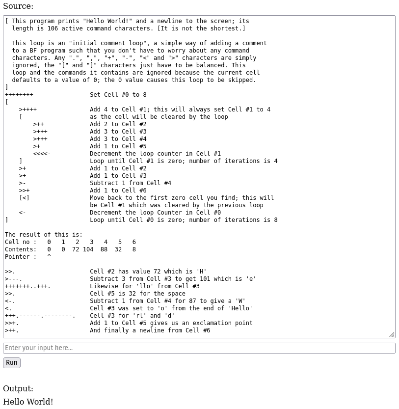

# Brainfuck - [Live Demo](https://dwayne.github.io/elm-brainfuck/)



A [Brainfuck](https://en.wikipedia.org/wiki/Brainfuck) interpreter written in [Elm](https://elm-lang.org/).

## What's interesting about it?

1. It showcases Elm's [data modeling](https://thoughtbot.com/blog/data-modeling-resources-in-elm) capabilities, see [`src/Brainfuck/Data`](./src/Brainfuck/Data).
2. [`Brainfuck.Data.Memory`](./src/Brainfuck/Data/Memory.elm) gives a Brainfuck program unbounded memory.
3. It provides an example of using [`elm/parser`](https://package.elm-lang.org/packages/elm/parser/latest/), albeit for a simple grammar. The [Monkey](https://github.com/dwayne/elm-monkey-interpreter) [parser](https://github.com/dwayne/elm-monkey-interpreter/blob/367751ac26ab04cfd8f2cc528641ad975f9e5665/src/Monkey/Parser.elm) was more interesting.
4. The parser and interpreter are well-tested, see [`Test.Brainfuck.Parser`](./tests/Test/Brainfuck/Parser.elm) and [`Test.Brainfuck.Interpreter`](./tests/Test/Brainfuck/Interpreter.elm).
5. The project makes use of [Parcel](https://parceljs.org/) and [Nix](https://nixos.org/). For the Elm transformer I use the Elm compiler from Nix rather than the one installed by `@parcel/transformer-elm`.

## How was it built?

I built it bottom-up, iteratively, in 5 parts.

### Part 1 - The parser

- I wrote the [grammar](./grammar.ebnf)
- From the grammar, I figured out the lexemes and I implemented the [lexical analyzer](./src/Brainfuck/Lexer.elm)
- From the grammar, I figured out the [AST](./src/Brainfuck/AST.elm)
- The grammar also guided me in the implementation of the [parser](./src/Brainfuck/Parser.elm)

Finally, I tested the parser, see [`Test.Brainfuck.Parser`](./tests/Test/Brainfuck/Parser.elm).

### Part 2 - The runtime system

- I added a data type for [bytes](./src/Brainfuck/Data/Byte.elm)
- I implemented [unbounded memory](./src/Brainfuck/Data/Memory.elm)
- I implemented representations for [input](./src/Brainfuck/Data/Input.elm) and [output](./src/Brainfuck/Data/Output.elm)
- Then, I combined everything to implement the [virtual machine](./src/Brainfuck/Data/Machine.elm)

For this part, I tested all the modules using the `elm repl`.

### Part 3 - The interpreter

- I implemented the [interpreter](./src/Brainfuck/Interpreter.elm)
- I tested the interpreter, see [`Test.Brainfuck.Interpreter`](./tests/Test/Brainfuck/Interpreter.elm)

### Part 4 - The UI

I spent the least amount of time on this part since it wasn't the highlight of the project for me.

- I implemented the UI, see [`Main`](./src/Main.elm)

## Usage

An isolated, reproducible development environment is provided with Nix. Enter using:

```bash
nix develop
```

### Chores

When you're in the development environment you can:

- Type `'f'` to run `elm-format`
- Type `'t'` to run `elm-test`
- Type `'d'` to run the application in development mode
- Type `'clean'` to remove build artifacts

### Build

To build the production version of the application:

```bash
nix build -L
# or
nix build .#app -L
```

### Serve

To serve the production version of the application:

```bash
nix run
# or
nix run .#app
```

### Check

```bash
nix flake check -L
```

### Deploy

To deploy the production version of the application to [GitHub Pages](https://docs.github.com/en/pages):

```bash
nix run .#deploy
```

To simulate the deployment you can do the following:

```bash
nix run .#deploy -- -s
```

### CI

- [`check.yml`](./.github/workflows/check.yml) runs checks on every change you push
- [`deploy.yml`](./.github/workflows/deploy.yml) deploys the production version of the application on every push to the master branch that successfully passes all checks

**N.B.** *The [Magic Nix Cache](https://determinate.systems/blog/magic-nix-cache/) is used for caching the Nix store.*
